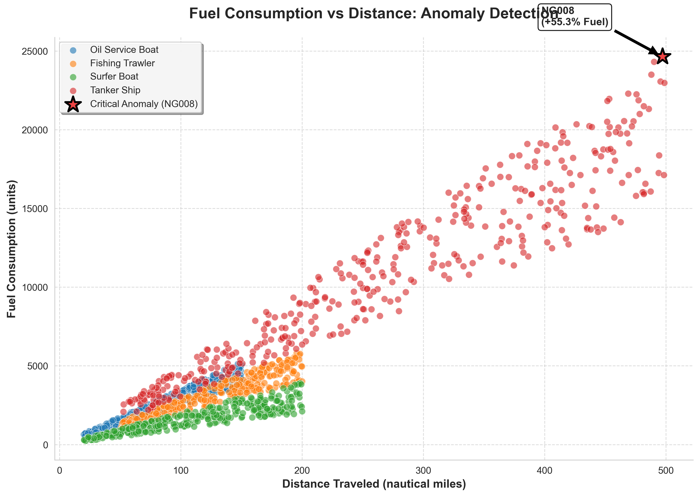

Name: Modou Lamin Kinteh 
Date: 09/January /2026 
Subject: Physical Diagnosis of Vessel NG008 Fuel Anomaly 
1. Introduction 
This memo presents a focused anomaly detection and physical reasoning analysis based on 
the MIND X maritime dataset of 1,440 voyage entries. The goal is to identify a single 
statistically significant anomaly and explain it using real maritime physics. The investigation 
found Vessel NG008, a tanker ship, showing extreme over-consumption of fuel despite 
operating in calm weather. This behavior strongly suggests a mechanical or hydrodynamic 
problem rather than environmental interference. 
2. Anomaly Identification 
Using Z-score detection (|Z| > 3) and distance-based regression modeling, Vessel NG008 was 
identified as the most severe outlier. The vessel traveled 497.16 nautical miles, but 
consumed 24,648 units of fuel, which is 55.3% above the predicted value (~15,870 units). 
This deviation is far beyond random variance and is not correlated with adverse weather, 
since the journey occurred in Calm conditions. 
The anomaly stands out visually in the scatter diagram below. 

This plot clearly shows: 
• The main linear trend for all ships 
• The NG008 point far above the regression line 
• Red anomaly marking 
3. Physical Explanation of the Anomaly 
Primary Root Cause: Hull Biofouling 
NG008’s extreme fuel consumption is best explained by severe hull biofouling — the 
accumulation of barnacles, algae, and marine growth on the ship’s underwater surface. 
From a physics standpoint: 
1. Increased Hydrodynamic Drag 
Fouling disrupts laminar flow around the hull, increasing the friction coefficient. The 
engines must generate significantly more thrust to maintain the same speed. 
2. Fuel Penalty Is Consistent with Observed Data 
Research shows fouling can increase fuel consumption by 20%–60%, which aligns 
closely with NG008’s +55.3% deviation. 
3. Calm Weather Rules Out Wave Resistance 
Since the sea state was calm, the high fuel burn cannot be blamed on rough seas or 
storm-induced resistance. 
Secondary Contribution: Engine Degradation 
NG008 operated at 72.14% engine efficiency, well below the fleet average of ~85%. When a 
degraded engine is combined with a fouled hull, the fuel penalty compounds: 
• More drag → engines must work harder 
• Worn injectors → incomplete combustion 
• Result → excessive fuel burn despite short distance 
5. Conclusion 
NG008 represents a clear and physically explainable fuel consumption anomaly. The 
combination of severe hull biofouling and reduced engine efficiency led to a 55% increase in 
fuel usage compared to expected values. This diagnosis provides actionable maintenance 
insight for the fleet: cleaning the hull and servicing the engine would significantly improve 
fuel efficiency, reduce emissions, and lower FuelEU Maritime penalties.
- **Region:** West African / Nigerian coastal routes

